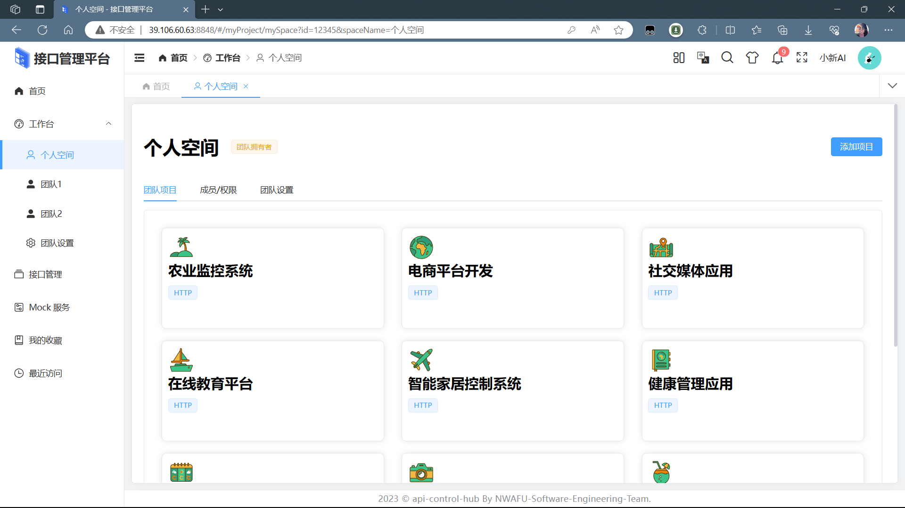
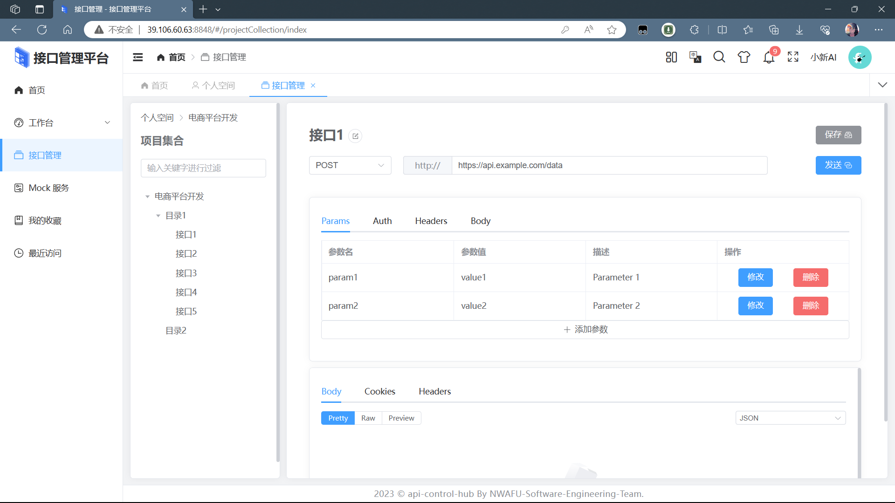
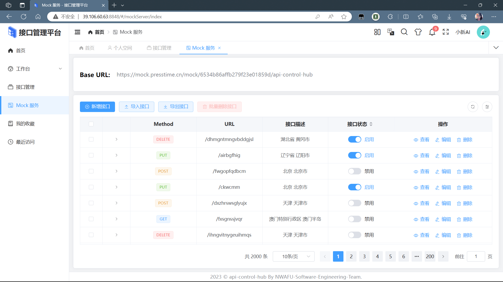
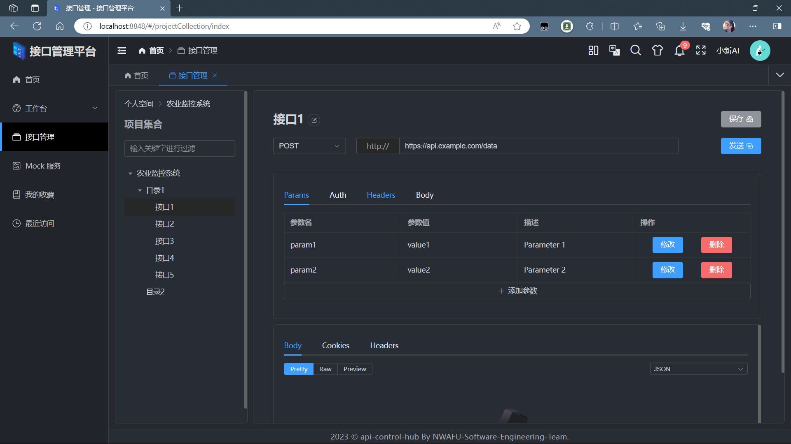

# api-control-hub

### 介绍 📖

api-control-hub 一款基于[Geeker Admin](https://github.com/HalseySpicy/Geeker-Admin)后台管理框架实现一种专门设计用于管理和维护API（应用程序编程接口）生命周期的软件工具，支持可视化创建和编辑HTTP接口文档，允许定义接口URL、HTTP方法（GET、POST等）、请求参数、响应结构等。

### 在线预览 👀

- Link：~~http://39.106.60.63:8848/~~

### 代码仓库 ⭐

- GitHub：[mmdxiaoxin/api-control-hub: HTTP接口管理平台 (github.com)](https://github.com/mmdxiaoxin/api-control-hub)
- Gitee：[api-control-hub: HTTP接口管理平台，实现对接口的管理和测试，包含有Mock服务。 (gitee.com)](https://gitee.com/haojingxin/api-control-hub)

### 项目功能 🔨

1. 项目管理：支持按项目维度管理接口集合，每个项目可单独设置管理、读写权限；
2. 接口管理：项目管理员可以通过平台添加、修改、删除接口，接口需要支持如下字段：
   - 名称、接口地址、请求方式、请求参数、返回数据等信息；
   - 其次，接口每次变更都需要记录相应更新日志，方便后续查看、回滚等；
3. 接口 Mock 服务：创建接口后，平台自动按照接口描述提供对应 mock 服务；
4. ~~版本管理：支持接口版本管理，包括历史版本的查看、回滚等操作，便于开发人员管理接口的变更历史。(待实现)~~

### 安装使用步骤 📔

- **Clone：**

```text
# Gitee
git clone https://gitee.com/haojingxin/api-control-hub
# GitHub
git clone https://github.com/NWAFU-Software-Engineering-Team/api-control-hub.git
```

- **Install：**

```text
pnpm install
```

- **Run：**

```text
pnpm dev
pnpm serve
```

- **Build：**

```text
# 开发环境
pnpm build:dev

# 测试环境
pnpm build:test

# 生产环境
pnpm build:pro
```

- **Lint：**

```text
# eslint 检测代码
pnpm lint:eslint

# prettier 格式化代码
pnpm lint:prettier

# stylelint 格式化样式
pnpm lint:stylelint
```

- **commit：**

```text
# 提交代码（提交前会自动执行 lint:lint-staged 命令）
pnpm commit
```

### 项目截图 📷

- 登陆界面
  

- 项目管理
  

- 接口管理
  

- Mock服务
  

- 夜间模式

  

### 文件资源目录 📚

```text
api-control-hub
├─ .husky                 # husky 配置文件
├─ .vscode                # VSCode 推荐配置
├─ build                  # Vite 配置项
├─ public                 # 静态资源文件（该文件夹不会被打包）
├─ src
│  ├─ api                 # API 接口管理
│  ├─ assets              # 静态资源文件
│  ├─ components          # 全局组件
│  ├─ config              # 全局配置项
│  ├─ directives          # 全局指令文件
│  ├─ enums               # 项目常用枚举
│  ├─ hooks               # 常用 Hooks 封装
│  ├─ languages           # 语言国际化 i18n
│  ├─ layouts             # 框架布局模块
│  ├─ routers             # 路由管理
│  ├─ stores              # pinia store
│  ├─ styles              # 全局样式文件
│  ├─ typings             # 全局 ts 声明
│  ├─ utils               # 常用工具库
│  ├─ views               # 项目所有页面
│  ├─ App.vue             # 项目主组件
│  ├─ main.ts             # 项目入口文件
│  └─ vite-env.d.ts       # 指定 ts 识别 vue
├─ .editorconfig          # 统一不同编辑器的编码风格
├─ .env                   # vite 常用配置
├─ .env.development       # 开发环境配置
├─ .env.production        # 生产环境配置
├─ .env.test              # 测试环境配置
├─ .eslintignore          # 忽略 Eslint 校验
├─ .eslintrc.cjs          # Eslint 校验配置文件
├─ .gitignore             # 忽略 git 提交
├─ .prettierignore        # 忽略 Prettier 格式化
├─ .prettierrc.cjs        # Prettier 格式化配置
├─ .stylelintignore       # 忽略 stylelint 格式化
├─ .stylelintrc.cjs       # stylelint 样式格式化配置
├─ CHANGELOG.md           # 项目更新日志
├─ commitlint.config.cjs  # git 提交规范配置
├─ index.html             # 入口 html
├─ LICENSE                # 开源协议文件
├─ lint-staged.config.cjs # lint-staged 配置文件
├─ package-lock.json      # 依赖包包版本锁
├─ package.json           # 依赖包管理
├─ postcss.config.cjs     # postcss 配置
├─ README.md              # README 介绍
├─ tsconfig.json          # typescript 全局配置
└─ vite.config.ts         # vite 全局配置文件
```

### 浏览器支持 🌎

- 本地开发推荐使用 Chrome 最新版浏览器 [Download](https://www.google.com/intl/zh-CN/chrome/)。
- 生产环境支持现代浏览器，不再支持 IE 浏览器，更多浏览器可以查看 [Can I Use Es Module](https://caniuse.com/?search=ESModule)。

|  |  |  |  |  |
| :---------------------------------------------: | :-----------------------------------------------: | :--------------------------------------------------: | :-------------------------------------------------: | :-------------------------------------------------: |
|                   not support                   |                  last 2 versions                  |                   last 2 versions                    |                   last 2 versions                   |                   last 2 versions                   |
